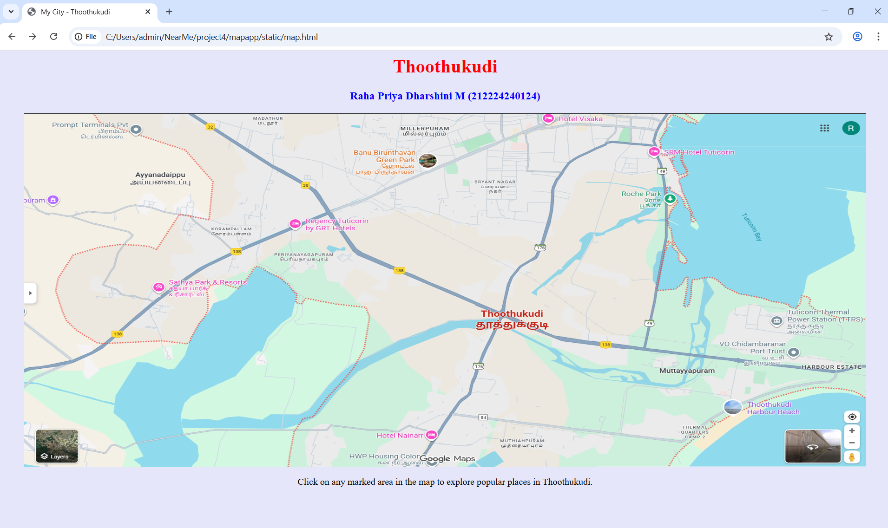
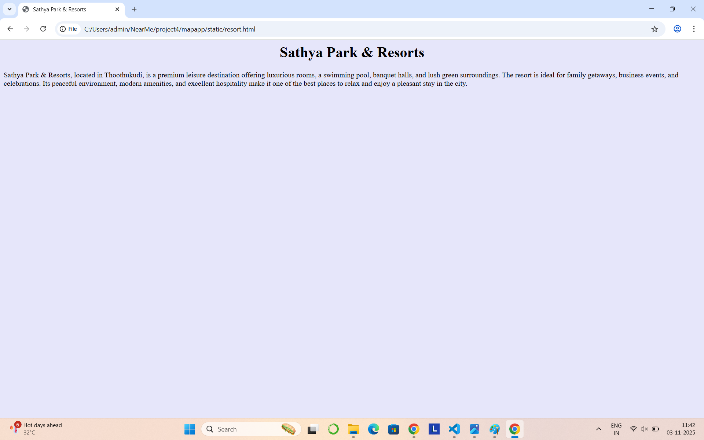
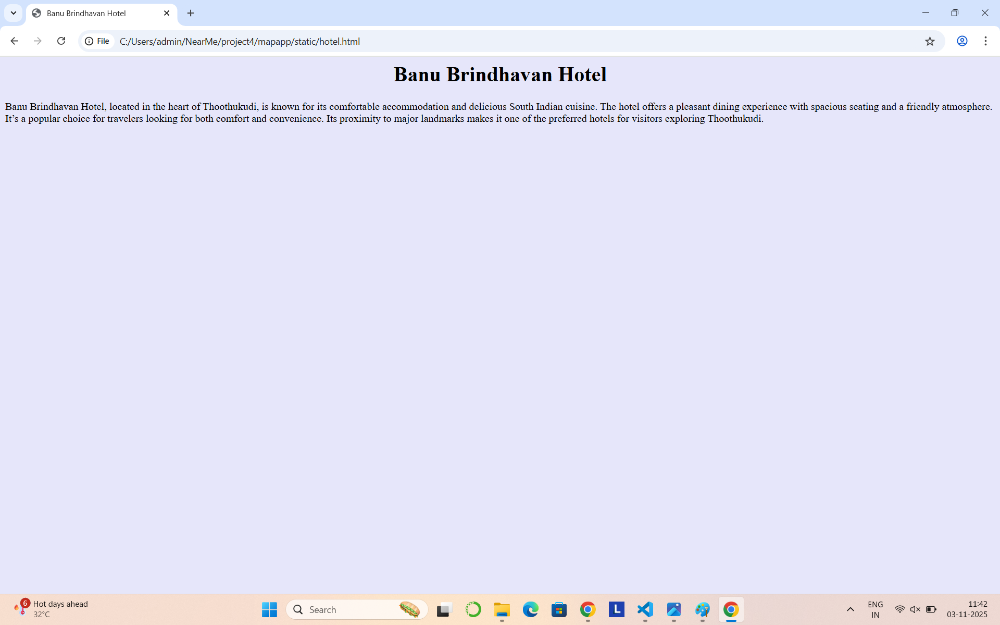
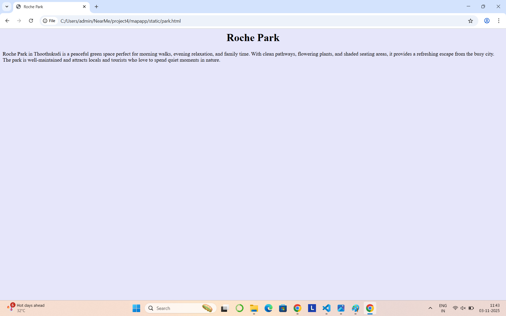

# Ex04 Places Around Me
## Date: 03-11-2025

## AIM
To develop a website to display details about the places around my house.

## DESIGN STEPS

### STEP 1
Create a Django admin interface.

### STEP 2
Download your city map from Google.

### STEP 3
Using ```<map>``` tag name the map.

### STEP 4
Create clickable regions in the image using ```<area>``` tag.

### STEP 5
Write HTML programs for all the regions identified.

### STEP 6
Execute the programs and publish them.

## CODE
## map.html
```
<html>
<head>
    <title>My City</title>
</head>
<body style="background-color: lavender;">
    <h1 align="center">
        <font color="red"><b>Thoothukudi</b></font>
    </h1>
    <h3 align="center">
        <font color="blue"><b>Raha Priya Dharshini M (212224240124)</b></font>
    </h3>

    <center>
        
        <map name="MyCity">
            <!-- Banu Brindhavan Hotel -->
            <area shape="circle" coords="770,130,80" href="hotel.html" alt="Banu Brindhavan Hotel" title="Banu Brindhavan Hotel">

            <!-- Sathya Park & Resorts -->
            <area shape="circle" coords="280,390,90" href="resort.html" alt="Sathya Park & Resorts" title="Sathya Park & Resorts">

            <!-- Roche Park (moved slightly inland) -->
            <area shape="circle" coords="1060,190,80" href="park.html" alt="Roche Park" title="Roche Park">

            <!-- Harbour Beach -->
            <area shape="circle" coords="1220,530,90" href="beach.html" alt="Harbour Beach" title="Harbour Beach">
        </map>

        <p>Click on any marked area in the map to explore popular places in Thoothukudi.</p>
    </center>
</body>
</html>
```

## beach.html
```
<html>
    <head>
        <title>Thoothukudi Harbour Beach</title>
    </head>
    <body bgcolor="lavender">
        <h1 align="center">Thoothukudi Harbour Beach</h1>
        <p>
            Thoothukudi Harbour Beach is a serene seaside attraction known for its golden sands, calm waves, and scenic sunsets. 
            Situated near the harbour, it offers a beautiful view of ships sailing across the Bay of Bengal. 
            Visitors come here to relax, enjoy the sea breeze, and capture the mesmerizing beauty of the coast. 
            It’s one of Thoothukudi’s most loved spots for an evening stroll.
        </p>
    </body>
</html>
```

## park.html

```
<html>
    <head>
        <title>Roche Park</title>
    </head>
    <body bgcolor="lavender">
        <h1 align="center">Roche Park</h1>
        <p>
            Roche Park in Thoothukudi is a peaceful green space perfect for morning walks, evening relaxation, and family time. 
            With clean pathways, flowering plants, and shaded seating areas, it provides a refreshing escape from the busy city. 
            The park is well-maintained and attracts locals and tourists who love to spend quiet moments in nature.
        </p>
    </body>
</html>
```

## resort.html
```
<html>
    <head>
        <title>Sathya Park & Resorts</title>
    </head>
    <body bgcolor="lavender">
        <h1 align="center">Sathya Park & Resorts</h1>
        <p>
            Sathya Park & Resorts, located in Thoothukudi, is a premium leisure destination offering luxurious rooms, a swimming pool, banquet halls, 
            and lush green surroundings. The resort is ideal for family getaways, business events, and celebrations. 
            Its peaceful environment, modern amenities, and excellent hospitality make it one of the best places to relax and enjoy a pleasant stay in the city.
        </p>
    </body>
</html>
```
## hotel.html
```
<html>
    <head>
        <title>Banu Brindhavan Hotel</title>
    </head>
    <body bgcolor="lavender">
        <h1 align="center">Banu Brindhavan Hotel</h1>
        <p>
            Banu Brindhavan Hotel, located in the heart of Thoothukudi, is known for its comfortable accommodation and delicious South Indian cuisine. 
            The hotel offers a pleasant dining experience with spacious seating and a friendly atmosphere. 
            It’s a popular choice for travelers looking for both comfort and convenience. 
            Its proximity to major landmarks makes it one of the preferred hotels for visitors exploring Thoothukudi.
        </p>
    </body>
</html>
```


## OUTPUT









## RESULT
The program for implementing image maps using HTML is executed successfully.
